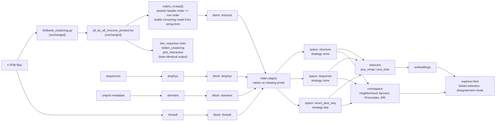

# Architecture — multi-space cartography

How the pieces fit. Design *decisions* and their justifications live in
`docs/adr/`; this document is the map.

---

## The one-sentence version

Several representations of the same proteins are computed independently over one
`protid` index, displayed side by side with linked selection, and combined into a
single geometry only when explicitly asked — because the most interesting signal
is where the representations *disagree*.

---

## Three concepts

| | What it is | What it may do | ADR |
|---|---|---|---|
| **Block** | a per-protein representation: `X ∈ ℝ^(N×D)` or a pairwise distance | declare a metric, a normalization, and whether it may enter a geometry | 0001 |
| **Space** | a geometry: blocks + strategy + metric + reducer | produce coordinates | 0001, 0002 |
| **View** | a rendering | **never** change geometry | 0001, 0005 |

The invariant that keeps this honest: **overlay never moves points; fusion always
does.** A `View` is handed coordinates, not blocks, so it has no way to alter
them.

---

## Package layout

```
ProteinCartography/
├── matrix_io.py            # the single labeled-matrix loader (ADR 0007)
├── index.py                # canonical protid index; align() raises, never reindexes
├── config_schema.py        # frozen dataclasses + from_legacy() — ADR 0010
├── spaces/
│   ├── base.py             # BlockSpec, BlockResult, BlockProvider, SpaceSpec
│   ├── registry.py         # entry-point discovery
│   ├── store.py            # read/write .npy + manifest, hash-based cache invalidation
│   ├── manifest.py         # provenance capture (ADR 0001 I5)
│   └── reducers/           # pca, umap, tsne — the existing behavior, extracted
├── blocks/
│   ├── tmscore.py          # the existing TM path, as a block
│   ├── threedi.py          # foldseek 3Di k-mer profile
│   ├── biophys.py          # Biopython ProtParam descriptors
│   └── domains.py          # InterPro/Pfam architecture strings
├── fusion.py               # none, early, late, graph (SNF) — ADR 0002, 0013
├── diagnostics/            # censoring today; stability, redundancy, controls to come
├── coregistration.py       # neighborhood Jaccard, Spearman, Procrustes — ADR 0011
├── enrichment.py           # cluster-level enrichment statistics — ADR 0012
└── explorer/               # single-file HTML generator (ADR 0005) — not yet built
```

Everything above is new. The existing scripts keep their names, their CLIs, and
their outputs.

---

## On-disk layout

Strictly additive — nothing existing moves.

```
OUTPUT_DIR/
├── blocks/{block_id}/
│   ├── features.npy | distances.npy   # float32; condensed for pairwise (ADR 0004)
│   ├── mask.npy                       # bool, censoring (ADR 0009)
│   ├── protids.txt                    # canonical order — identity lives here
│   └── manifest.json
├── spaces/{space_id}/
│   ├── distance.npy
│   ├── embedding_{reducer}.tsv        # protid, dim_1, dim_2[, dim_3]
│   ├── neighbors_k{K}.parquet
│   ├── clusters_{algo}_r{res}.tsv
│   ├── diagnostics.json
│   └── manifest.json
├── crossspace/
│   ├── neighbor_jaccard.parquet
│   ├── block_correlation.tsv
│   └── stability.parquet
└── final_results/
    ├── (every existing output, byte-identical)
    └── {analysis_name}_explorer.html
```

---

## Data flow



The legacy path on the right keeps running and keeps producing identical bytes.
The new path on the left reads the same matrix file and adds capability beside
it. That parallelism is what makes the parity test meaningful.

---

## The contracts

**1. Identity lives in labels, never in position.** Every array is accompanied by
`protids.txt`. `matrix_io` refuses to return a bare array. `index.align()`
**raises** on a missing protid rather than reindexing to NaN — pandas will do the
latter by default, and it is the most likely source of a subtle wrong answer
here. (ADR 0007)

**2. A zero in the TM matrix is missing, not measured.** 60.5% of a production
matrix is fill, and zero of those fills is a measured value. The mask is carried
explicitly, built by string form during parse. (ADR 0009)

**3. Block scale is normalized before weighting, always.** Contribution shares
are computed, recorded, logged, and displayed, and must sum to 1. (ADR 0002)

**4. Some signals never enter a geometry.** Enforced by the config validator with
an error that states the reason. (ADR 0003)

**5. Every space carries provenance sufficient to recompute it exactly** — block
versions, weights, normalization, metric, reducer params, seeds, input hashes.
(ADR 0001)

**6. Default behavior is byte-identical to today's**, proven by the parity test
against an unmodified checkout of the commit this branch forked from
`upstream/main`. (commit group 5)

**7. Optional dependencies stay optional**, proven by a CI job that installs none
of them. (ADR 0006)

---

## Extension: adding a block without touching this code

```toml
# in a third-party package's pyproject.toml
[project.entry-points."proteincartography.blocks"]
mything = "mypkg.blocks:MyThingProvider"
```

```python
class MyThingProvider:
    spec_schema = MyThingParams

    def is_available(self) -> tuple[bool, str]:
        try:
            import mydep  # noqa: F401
        except ImportError:
            return False, "pip install mydep"
        return True, ""

    def compute(self, ctx: PipelineContext, params: dict) -> BlockResult:
        ...
```

Nothing in this repo changes. `registry.py` discovers it, the config validator
type-checks its params against `spec_schema`, and the Snakefile skips it with a
clear log line if `is_available()` is false. A worked example is in
`docs/EXTENDING.md`.

---

## Scale

Behavior is stated, not hidden. Full numbers in ADR 0004.

| N | censoring | dense TSV | practical verdict |
|---|---|---|---|
| 500 | 0% | 2.5 MB | trivial |
| 2,530 | 60.5% (measured) | 40.8 MB | comfortable |
| 5,000 (shipped default) | ~80% | ~130 MB | at the working limit |
| 50,000 | ~98% | ~10.3 GB | not loadable |

The dense matrix grows as O(N²) while the information in it grows as O(1000·N).
`float32` + condensed storage buys roughly 8× over the dense float64 TSV
equivalent, moving the ceiling toward N≈15,000. A sparse backend is deliberately
not built yet; the mask is what makes it possible later, behind `store.py`.

---

## What this deliberately does not do

- No sparse or out-of-core backend (ADR 0004).
- No served application (ADR 0005).
- No imputation of censored values (ADR 0009).
- No retrofit of `matrix_io` into the five existing label-safe consumers
  (`docs/FOLLOWUPS.md` #14).
- No live weight-slider re-embedding — precomputed presets instead (ADR 0002).
- Phylogeny stays out of every geometry (ADR 0003).
